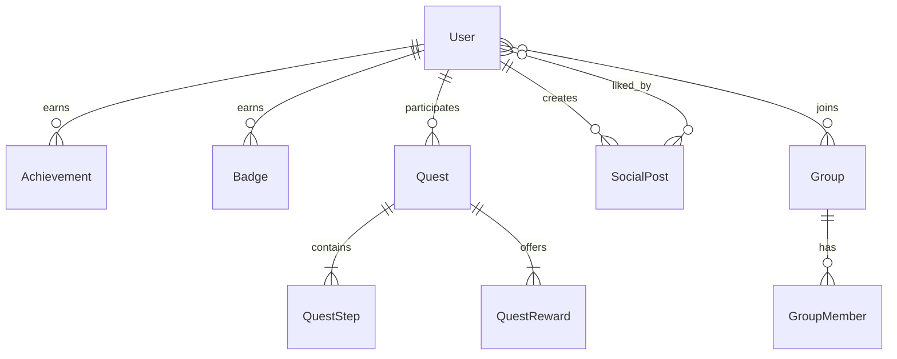

# Data Model: Complete TanStack Query Migration Phase 2

**Created**: 2025-11-30  
**Purpose**: Define hook interfaces and entity types for Phase 2 migration

## Entity Definitions

### Achievement

```typescript
interface Achievement {
  id: string;
  title: string;
  description: string;
  icon: string;               // Icon URL or icon name
  category: AchievementCategory;
  points: number;
  isEarned: boolean;
  earnedAt?: string;          // ISO date string
  progress?: number;          // 0-100 for progressive achievements
  criteria: AchievementCriteria;
}

type AchievementCategory = 
  | 'learning' 
  | 'social' 
  | 'quest' 
  | 'engagement' 
  | 'special';

interface AchievementCriteria {
  type: 'count' | 'streak' | 'milestone' | 'manual';
  target?: number;
  current?: number;
}

interface AchievementFilters {
  category?: AchievementCategory;
  earned?: boolean;
  page?: number;
  limit?: number;
}
```

### Badge

```typescript
interface Badge {
  id: string;
  name: string;
  description: string;
  tier: BadgeTier;
  imageUrl: string;
  criteria: string;           // Human-readable criteria
  isEarned: boolean;
  earnedAt?: string;          // ISO date string
  earnedCount?: number;       // How many users earned this
}

type BadgeTier = 'bronze' | 'silver' | 'gold' | 'platinum';
```

### Quest & QuestStep

```typescript
interface Quest {
  id: string;
  title: string;
  description: string;
  type: QuestType;
  status: QuestStatus;
  steps: QuestStep[];
  rewards: QuestReward[];
  progress: number;           // 0-100
  startedAt?: string;
  completedAt?: string;
  expiresAt?: string;
}

type QuestType = 'daily' | 'weekly' | 'challenge' | 'storyline';
type QuestStatus = 'available' | 'in_progress' | 'completed' | 'expired';

interface QuestStep {
  id: string;
  description: string;
  isCompleted: boolean;
  completedAt?: string;
  order: number;
}

interface QuestReward {
  type: 'xp' | 'badge' | 'points' | 'item';
  value: number | string;
  claimed: boolean;
}

interface QuestProgress {
  questId: string;
  progress: number;
  completedSteps: string[];   // Step IDs
  currentStep?: string;       // Current step ID
  updatedAt: string;
}
```

### Admin Entities

```typescript
interface AdminStats {
  totalUsers: number;
  activeUsers: number;        // Last 7 days
  totalQuests: number;
  completedQuests: number;
  totalRevenue: number;
  revenueThisMonth: number;
  newUsersToday: number;
  newUsersThisWeek: number;
}

interface AdminUserFilters {
  search?: string;
  role?: UserRole;
  status?: 'active' | 'suspended' | 'pending';
  page?: number;
  limit?: number;
}

interface AuditLogEntry {
  id: string;
  action: string;
  actorId: string;
  actorEmail: string;
  targetType: string;
  targetId?: string;
  metadata?: Record<string, unknown>;
  createdAt: string;
}

interface AuditLogFilters {
  action?: string;
  actorId?: string;
  startDate?: string;
  endDate?: string;
  page?: number;
  limit?: number;
}
```

### Analytics Entities

```typescript
interface UserAnalytics {
  userId: string;
  totalXP: number;
  level: number;
  questsCompleted: number;
  achievementsEarned: number;
  badgesEarned: number;
  streakDays: number;
  lastActiveAt: string;
  joinedAt: string;
}

interface EngagementData {
  timeRange: TimeRange;
  dataPoints: EngagementDataPoint[];
  summary: EngagementSummary;
}

interface EngagementDataPoint {
  date: string;               // ISO date
  activeUsers: number;
  questsStarted: number;
  questsCompleted: number;
  postsCreated: number;
}

interface EngagementSummary {
  totalActiveUsers: number;
  avgDailyActive: number;
  engagementRate: number;     // Percentage
  peakDay: string;
}

type TimeRange = '7d' | '30d' | '90d' | '1y';
```

### Social Entities

```typescript
interface SocialPost {
  id: string;
  authorId: string;
  author: PostAuthor;
  content: string;
  mediaUrls?: string[];
  likes: number;
  comments: number;
  isLiked: boolean;           // By current user
  createdAt: string;
  updatedAt?: string;
}

interface PostAuthor {
  id: string;
  username: string;
  displayName: string;
  avatarUrl?: string;
}

interface CreatePostInput {
  content: string;
  mediaUrls?: string[];
}

interface Group {
  id: string;
  name: string;
  description: string;
  imageUrl?: string;
  memberCount: number;
  isJoined: boolean;          // By current user
  isPublic: boolean;
  createdAt: string;
  createdBy: string;
  members?: GroupMember[];    // Only in detail view
}

interface GroupMember {
  userId: string;
  username: string;
  displayName: string;
  avatarUrl?: string;
  role: 'owner' | 'admin' | 'member';
  joinedAt: string;
}

interface GroupFilters {
  search?: string;
  joined?: boolean;
  page?: number;
  limit?: number;
}
```

## Hook Interfaces

### Achievement Hooks

```typescript
// useAchievements.ts
export function useAchievements(
  filters?: AchievementFilters
): UseQueryResult<Achievement[], Error>;

export function useUserAchievements(
  userId: string
): UseQueryResult<Achievement[], Error>;

export function useAchievement(
  achievementId: string
): UseQueryResult<Achievement, Error>;

// Return type structure
interface UseAchievementsReturn {
  data: Achievement[] | undefined;
  isLoading: boolean;
  isError: boolean;
  error: Error | null;
  isFetching: boolean;        // Background refetch
  dataUpdatedAt: number;      // For StaleDataIndicator
  refetch: () => Promise<QueryObserverResult>;
}
```

### Badge Hooks

```typescript
// useBadges.ts
export function useBadges(): UseQueryResult<Badge[], Error>;

export function useUserBadges(
  userId: string
): UseQueryResult<Badge[], Error>;

export function useBadge(
  badgeId: string
): UseQueryResult<Badge, Error>;
```

### Quest Hooks

```typescript
// useQuests.ts (extend existing)
export function useQuestProgress(
  questId: string
): UseQueryResult<QuestProgress, Error>;

// useQuestMutations.ts
export function useCompleteQuestStep(): UseMutationResult<
  QuestProgress,
  Error,
  { questId: string; stepId: string },
  { previousProgress: QuestProgress | undefined }
>;
```

### Admin Hooks

```typescript
// useAdmin.ts
export function useAdminStats(): UseQueryResult<AdminStats, Error>;

export function useAdminUsers(
  filters?: AdminUserFilters
): UseQueryResult<PaginatedResponse<User>, Error>;

export function useAdminAuditLog(
  filters?: AuditLogFilters
): UseQueryResult<AuditLogEntry[], Error>;

// useAdminMutations.ts
export function useRotateDEK(): UseMutationResult<void, Error, void, unknown>;
```

### Analytics Hooks

```typescript
// useAnalytics.ts (extend existing)
export function useEngagementChart(
  timeRange: TimeRange
): UseQueryResult<EngagementData, Error>;
```

### Social Hooks

```typescript
// useSocialFeed.ts
export function useInfiniteSocialPosts(): UseInfiniteQueryResult<
  InfiniteData<PaginatedResponse<SocialPost>>,
  Error
>;

export function useSocialPost(
  postId: string
): UseQueryResult<SocialPost, Error>;

// useSocialMutations.ts
export function useLikePost(): UseMutationResult<
  SocialPost,
  Error,
  string,                     // postId
  { previousPost: SocialPost | undefined }
>;

export function useUnlikePost(): UseMutationResult<
  SocialPost,
  Error,
  string,
  { previousPost: SocialPost | undefined }
>;

export function useCreatePost(): UseMutationResult<
  SocialPost,
  Error,
  CreatePostInput,
  unknown
>;

export function useDeletePost(): UseMutationResult<
  void,
  Error,
  string,
  { previousPosts: InfiniteData<PaginatedResponse<SocialPost>> | undefined }
>;
```

### Group Hooks

```typescript
// useGroups.ts
export function useGroups(
  filters?: GroupFilters
): UseQueryResult<Group[], Error>;

export function useGroup(
  groupId: string
): UseQueryResult<Group, Error>;

// useGroupMutations.ts
export function useJoinGroup(): UseMutationResult<
  Group,
  Error,
  string,                     // groupId
  { previousGroup: Group | undefined }
>;

export function useLeaveGroup(): UseMutationResult<
  void,
  Error,
  string,
  { previousGroup: Group | undefined }
>;

export function useCreateGroup(): UseMutationResult<
  Group,
  Error,
  CreateGroupInput,
  unknown
>;
```

## Paginated Response Type

```typescript
interface PaginatedResponse<T> {
  data: T[];
  nextCursor?: string;        // For cursor-based pagination
  hasMore: boolean;
  total?: number;             // If available from API
}
```

## Cache Key Types

```typescript
// Extend existing queryKeys type
interface QueryKeys {
  // ... existing keys ...
  
  achievements: {
    all: readonly ['achievements'];
    list: (filters?: AchievementFilters) => readonly ['achievements', 'list', AchievementFilters | undefined];
    detail: (id: string) => readonly ['achievements', 'detail', string];
    user: (userId: string) => readonly ['achievements', 'user', string];
  };
  
  badges: {
    all: readonly ['badges'];
    list: () => readonly ['badges', 'list'];
    user: (userId: string) => readonly ['badges', 'user', string];
    detail: (id: string) => readonly ['badges', 'detail', string];
  };
  
  admin: {
    all: readonly ['admin'];
    stats: () => readonly ['admin', 'stats'];
    users: (filters?: AdminUserFilters) => readonly ['admin', 'users', AdminUserFilters | undefined];
    keys: () => readonly ['admin', 'keys'];
    auditLog: (filters?: AuditLogFilters) => readonly ['admin', 'auditLog', AuditLogFilters | undefined];
  };
  
  social: {
    // ... existing social keys ...
    feed: () => readonly ['social', 'feed'];
    feedInfinite: () => readonly ['social', 'feed', 'infinite'];
    post: (id: string) => readonly ['social', 'post', string];
    groups: (filters?: GroupFilters) => readonly ['social', 'groups', GroupFilters | undefined];
    group: (id: string) => readonly ['social', 'group', string];
    groupMembers: (groupId: string) => readonly ['social', 'group', string, 'members'];
  };
}
```

## Relationships



## State Transitions

### Quest Status Flow

```
available → in_progress → completed
    ↓           ↓
  expired    expired
```

### Achievement Progress Flow

```
locked (progress: 0) → in_progress (0 < progress < 100) → unlocked (progress: 100, isEarned: true)
```

### Post Like State

```
isLiked: false ←→ isLiked: true (optimistic toggle)
      ↓                  ↓
   likes--            likes++
```
